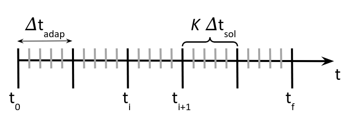

# MAdLib-PyFR
This repository implements various components to couple [MAdLib](https://sites.uclouvain.be/madlib/) and [PyFR](https://pyfr.readthedocs.io/en/latest/index.html) hence enabling high-order mesh adaptation.

The coupling is external and works as follows:

1. For a given mesh of specific order, PyFR is used to compute an unsteady CFD solution made of several timesteps.
2. The solution timesteps are then converted from PyFR (.pyfrs) to vtk (.vtu) format.
3. The mesh and solutions are processed with MAdLib that computes the instantaneous or averaged metrics used to design an adapted mesh.

During the last step, VTK is used to pair the mesh nodes with the solution points, that is how MAdLib can compute the metric-field and in turns perform mesh adaptation.

The project has the following structure:
```
MAdLib-PyFR/
├── examples/         example folders
│ └── 2d-euler-vortex
│ ├── 2d-inc-cylinder
│ ├── 2d-ogv-blade
├── madlib/           files and folder to be copied to MAdLib's source code
│ ├── Testcases
│ └── CMakeLists.txt
├── madlib_pyfr/      project source code to couple MAdLib and PyFR
├── mesh/             basic gmsh scripts to build example meshes
├── README.md         main documentation
```

## Installation
The coupling of PyFR with MAdLib relies on the following main dependencies:

- `VTK`: the visualization toolkit software can be downloaded from its website [here](https://vtk.org/),
- `MAdLib`: the mesh adaptation software can be installed from its website [here](https://sites.uclouvain.be/madlib/),
- `PyFR`: the high-order CFD software can be installed by following the documentation guidelines [here](https://pyfr.readthedocs.io/en/latest/installation.html),
- `MAdLib-PyFR`: the present framework can be cloned from github (that's where you should read this),
- `Paraview`: the post-processing software can be downloaded from its website [here](https://www.paraview.org/download/).

The following step-by-step procedure details how to go through the whole installation on an Ubuntu machine:

### VTK
You can start by downloading and install VTK if it is not already available on your machine. To do so:
```sh
mkdir vtk
git clone --recursive https://gitlab.kitware.com/vtk/vtk.git vtk/source
```

Then, all its building dependencies can be installed by running:
```sh
sudo apt install \
build-essential \
cmake \
cmake-curses-gui \
mesa-common-dev \
mesa-utils \
freeglut3-dev \
ninja-build
```

CMake can be configured with the commands below:
```sh
mkdir -p vtk/build && cd vtk/build
cmake ../source
```

And the code can finally be built in parallel with 8 cores:
```sh
cmake --build . -j 8
```

📝 **Note**: this last step may take a long time to execute depending on the specified number of cores.

### MAdLib
You can now move back to the working directory and clone the present repository:
```sh
cd ../..
git clone git@github.com:mschouler/MAdLib-PyFR.git
```

The latest stable version of MAdLib can be downloaded with the following commands:
```sh
mkdir MAdLib && cd MAdLib
svn co https://svn.cenaero.be/MAdLib/trunk
```

To compile MAdLib with VTK, `CMakeLists.txt` should be edited to contain the following lines:
```txt
# ----- VTK -----
# Set the path to the VTK folder
set(VTK_DIR "/path/to/vtk/build")

# Find VTK package
find_package(VTK)
if(VTK_FOUND)
  set(MADLIB_EXTERNAL_INCLUDE_DIRS ${MADLIB_EXTERNAL_INCLUDE_DIRS}
                                    ${VTK_LIBRARIES})
  message(STATUS "VTK is found")
endif()

#########################################################################
# Build sub-libraries
#########################################################################
...

if (VTK_FOUND)
    target_include_directories(MAdLib SYSTEM PUBLIC ${VTK_INCLUDE_DIRS})
    target_link_libraries(MAdLib ${VTK_LIBRARIES})
endif()

#########################################################################
# Testing
#########################################################################
...
```

Such modified version of `CMakeLists.txt` is available in `MAdLib-PyFR/madlib`:
```sh
cp ../MAdLib-PyFR/madlib/CMakeLists.txt trunk/
```

The path to the VTK build dir can be set to the user's path: `set(VTK_DIR "/path/to/vtk/build")`.

As part of its build, MAdLib also compiles all testcases which contain our custom adaptation scripts. One way to proceed is to implement an adaptation script for each use-case. Such scripts are written in c++ and available in `MAdLib-PyFR/madlib/Testcases`. Their existence is specified line 7 of `Testcases/CMakeLists.txt`.

The use-case folder can be updated at once by running:
```sh
cp -r ../MAdLib-PyFR/madlib/Testcases/* trunk/Testcases/
```

MAdLib can now be built:
```sh
cd trunk
mkdir build && cd build
cmake ..
make -j 8
make install
```

Depending on your setup, the install may fails due to missing `blas`/`lapack` dependencies. If so, you can install them by running:
```sh
sudo apt-get install libblas-dev liblapack-dev
```
and go back to the previous building command.

At that point you should have a working MAdLib install with a bunch of new executables contained in `MAdLib/trunk/build/Testcases/`. 

💡 **Tip**: assuming that no modification is made to MAdLib's core code, all Testcases code can directly be recompiled via the `make install` command. This will automatically update the corresponding executables.

📝 **Note**: as of June 2025, the user may want to install the development branch that should soon support periodic boundary conditions:
```sh
svn co https://svn.cenaero.be/MAdLib/branches/PeriodicAdaptation.29.01.2025
```
In this case, the `CMakeLists.txt` should be modified accordingly.

### PyFR
Let us first go back to the working directory:
```sh
cd ../../..
```

As PyFR is an HPC software which essentially relies on Python code, its installation requires a recent version of Python and MPI:
```sh
sudo apt install python3 python3-pip libopenmpi-dev openmpi-bin
```

It also requires `libxsmm`:
```sh
git clone https://github.com/libxsmm/libxsmm.git
cd libxsmm
make -j4 STATIC=0 BLAS=0
export PYFR_XSMM_LIBRARY_PATH=`pwd`/lib/libxsmm.so
cd ..
```

It can finally be installed in a virtual environment that will be shared with the present framework:
```sh
cd MAdLib-PyFR
python3 -m venv pyfr-venv
source pyfr-venv/bin/activate
echo "pip install pyfr"
```

As of June 2025, the adaptation requires features available in the develop branch of PyFR:
```sh
pip install "git+https://github.com/PyFR/PyFR.git@develop"
```

This last command will install various Python packages also useful to the adaptation framework.

### MAdLib-PyFR

Assuming that the user still is in the Python virtual environment previously built, the framework and its dependencies can now be installed:
```sh
pip install -e .
```

## Getting started
If the installation proceeded correctly, the user can navigate the examples, each one is accompanied by its own piece of documentation:

- [2d Euler vortex](examples/2d-euler-vortex/): a simple use-case based on PyFR most basic example,
- [2d incompressible cylinder](examples/2d-inc-cylinder/): a more complicated use-case compatible with high-order meshes, averaged and automatic adaptation,
- [2d outlet guide vane compressor blade](examples/2d-ogv-blade/): a turbomachinery use-case compatible with high-order meshes, averaged and automatic adaptation.

## Adaptation process
The adaptation process is based upon the `Adapter` class which. For each adaptation iteration, goes through the following steps (see `adaptation_step`):

1. The step is incremented and the output directory is built
2. The mesh is converted from .msh to .pyfrm format (see `import_mesh`)
3. The .ini file is updated to produce solutions in the appropriate time interval (see `update_ini`)

📝 **Note**: for each step, PyFR will produce `K` solutions files (see figure below).

4. PyFR is executed from scratch and the initial mesh or restarted from the previous solution and the last generated mesh (see `run_pyfr`)
5. All solution files are converted from .pyfrs to .vtu format (see `export_vtk`)
6. The solution files are processed to produces derived quantities such as the velocity magnitude (see `compute_vtk`)
7. The solution files to be used by MAdLib to compute the metric-field are listed in a text file and passed to MAdLib as one of its inputs (see `adap_madlib`)

📝 **Note**: this last step generates an adapted mesh in .msh format. In addition, the mesh complexity is read following MAdLib's first execution. It is then multiplied by a given complexity factor and added to the execution command because specifying the complexity target to MAdLib is necessary to ensure the mesh fineness control across all iterations.

8. Due to Gmsh version format constraints, the adapted mesh is reformatted (see `edit_gmsh`) and converted to .pyfrm format
9. The last solution is re-interpolated on the newly produced mesh (see `resample_pyfr`) which will generate a new solution file in .pyfrs format
10. This solution file is converted to .vtk format and the corresponding derived quantities are computed
11. The adaptation restarts from (1) with the adapted mesh and its interpolated solution.

From the adaptation perspective, the timescale is illustrated on the figure below where adaptation takes place every $\Delta t_\text{adap}$: 



If the adaptation is not instantaneous, the metric-field will combine $K$ solution files produced every $\Delta t_\text{sol}$ time steps over the last $\Delta t_\text{adap}$. Otherwise, it will only compute the metric-field from the last solution file.

⚠️ **Warning**: in PyFR,  $\Delta t_\text{sol}$ corresponds to `dt-out` in  the solution plugin writer which defines when to write solution files. It is different from the actual timestep $\Delta t$ which is used by the solver defined as `dt` in the solver time integrator.