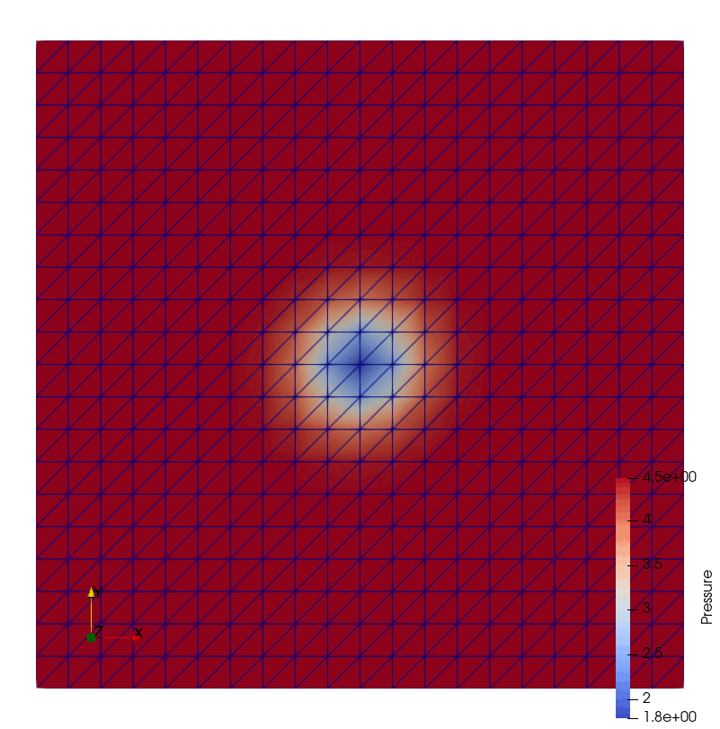

# 2D Euler Vortex

This example comes from PyFR's original example (see [here](https://pyfr.readthedocs.io/en/latest/examples.html#d-euler-vortex)).

It has the following characteristics:

- it relies on Euler's equations,
- it has periodic boundaries in each direction.

## Getting started

This use-case can be executed with the following steps:

First, move to the example directory:
```sh
cd examples/2d-euler-vortex
```

The default mesh in the folder can be generated with the following command:
```sh
python3 ../../mesh/square_mesh.py --name euler-vortex
```
which should generate a first order unstructured mesh.

The adaptation script can then be executed:
```sh
python3 euler-adap.py --mesh euler-vortex.msh --ini euler-vortex.ini --nite 8
```

📝 **Note**: as of June 2025, MAdLib still experiences issues with periodic boundaries. For this example, periodic boundaries are frozen which results in small elements at the upper boundary as the vortex approaches it. Ultimately, this causes the computation to fail which is why the number of iterations should be kept below 9.

Results are saved in the `output/out_N` directories and can be visualized with Paraview by loading `euler-vortex.vtu.series`. The .gif below illustrates the reference and adapted solutions obtained with unstructured meshes of order 1:
<p float="left">
  
   
</p>


## Detailed description
### Meshing script
The `square_mesh.py` script can be used to generate a simple squared domain mesh:
```sh
usage: square_mesh.py [-h] [-c CONFIG] [-n NAME] [-out OUTDIR] [-f FORMAT] [-k ORDER] [-l]
                      [-g] [-s]

options:
  -h, --help            show this help message and exit
  -c CONFIG, --config CONFIG
                        mesh config file (default: )
  -n NAME, --name NAME  mesh name (default: madlib_pyfr_mesh)
  -out OUTDIR, --outdir OUTDIR
                        mesh output directory (default:
                        /home/mschouler/Documents/Sorbonne/MAdLib-PyFR/examples/2d-euler-
                        vortex)
  -f FORMAT, --format FORMAT
                        mesh format (default: msh)
  -k ORDER, --order ORDER
                        mesh order (default: 1)
  -l, --log             generate gmsh .log file (default: False)
  -g, --geo             generate gmsh .geo file (default: False)
  -s, --structured      generates a structured mesh (default: False)
```

The same script can be used to generate both structured and unstructured mesh of any order based on the options passed to it. This can be convenient to generate reference solutions with PyFR but be aware that structured meshes can not be used for anisotropic mesh adaptation.


### MAdLIb script
The `2dEulerVortex/main.cc` adaptation script is based on the `solAnisoAdaptation2D` example. It is as simple as it gets and should be executed as follows:
```sh
2dEulerVortex path/to/mesh.msh path/to/solution.vtu path/to/adapted/mesh.msh
```
The first two arguments are inputs, the third one is the script's output.

The only specificity of the script lies in the `fixBoundaryEdges` function which freezes nodes on the domain boarders to preserve the periodic structure of the mesh.

Finally, although this use-case adaptation script is compatible with any solution order, it uses the Hessian based algorithm to compute the metric-field. Strictly speaking, this means that it will not perform high-order adaptation regardless of the mesh and solution order (see the cylinder example for more information about that).

### Coupling script
The `euler-adap.py` script implements a the most basic coupling version of MAdLib and PyFR where the adaptation is run instantaneously for a few iterations:
```sh
usage: euler-adap.py [-h] -m MESH -i INI [-o OUTDIR] [-n NITE] [-dt TIME_STEP]

options:
  -h, --help            show this help message and exit
  -m MESH, --mesh MESH  gmsh file (default: None)
  -i INI, --ini INI     PyFR input file (default: None)
  -o OUTDIR, --outdir OUTDIR
                        output directory (default: output)
  -n NITE, --nite NITE  the number of iterations (default: 10)
  -dt TIME_STEP, --time-step TIME_STEP
                        the saved solution timestep (default: 1.0)
```

It relies on the `EulerAdapter` class which is a simplification of the full `Adapter` class that avoids using some unnecessary features of the adaptation process. Namely, this use-case only performs instantaneous adaptation directly from the density field.

⚠️ **Warning**: the path to the MAdLib adaptation script is hardcoded at the top of `euler-adap.py` and may need editing to match the user's environment. This avoids to specify it manually as an input or to use a configuration file just for this command.