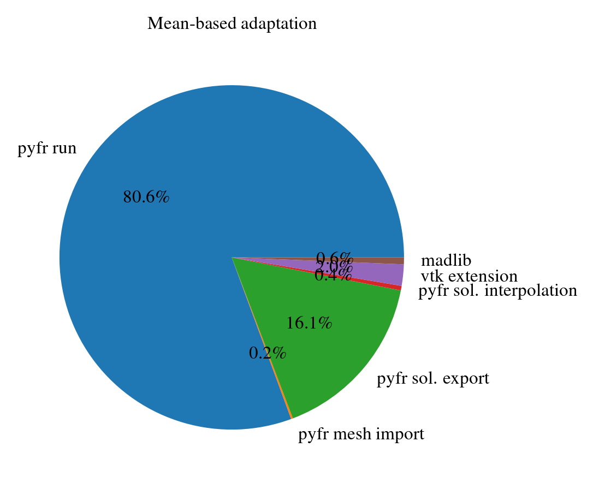

# 2D Incompressible Cylinder

This example comes from PyFR's original example (see [here](https://pyfr.readthedocs.io/en/latest/examples.html#d-incompressible-cylinder-flow)).

It has the following characteristics:

- it relies on Navier-Stokes incompressible equations,
- the Reynolds number is 200.

## Getting started

This use-case can be executed with the following steps:

First, move to the example directory:
```sh
cd examples/2d-inc-cylinder
```

The default mesh in the folder can be generated with the following command:
```sh
python3 ../../mesh/cylinder_mesh.py --name inc-cylinder
```
which should generate a first order unstructured mesh.

The adaptation script can then be executed:
```sh
python3 cylinder-adap.py --config inc-cylinder-inst.json
```

Results are saved in the `output/out_N` directories and can be visualized with Paraview by loading `inc-cylinder.vtu.series`. The .gif below illustrates the evolution of the mesh and velocity magnitude for an instantaneous adaptation process triggered every unit of time:


## Detailed description
### Meshing script
The `cylinder_mesh.py` script can be used to generate a simple rectangle domain mesh with a unit diameter cylinder:
```sh
usage: cylinder_mesh.py [-h] [-c CONFIG] [-n NAME] [-out OUTDIR] [-f FORMAT] [-k ORDER] [-l]
                        [-g] [-s] [-d DIAMETER] [--coarse]

options:
  -h, --help            show this help message and exit
  -c CONFIG, --config CONFIG
                        mesh config file (default: )
  -n NAME, --name NAME  mesh name (default: madlib_pyfr_mesh)
  -out OUTDIR, --outdir OUTDIR
                        mesh output directory (default:
                        /home/mschouler/Documents/Sorbonne/MAdLib-PyFR/examples/2d-inc-
                        cylinder)
  -f FORMAT, --format FORMAT
                        mesh format (default: msh)
  -k ORDER, --order ORDER
                        mesh order (default: 1)
  -l, --log             generate gmsh .log file (default: False)
  -g, --geo             generate gmsh .geo file (default: False)
  -s, --structured      generates a structured mesh (default: False)
  -d DIAMETER, --diameter DIAMETER
                        cylinder diameter (default: 1)
  --coarse              generate a coarse mesh (default: False)
```

The same script can be used to generate both pseudo-structured (i.e. with quads) and unstructured meshes of any order based on the options passed to it. This can be convenient to generate reference solutions with PyFR but be aware that structured meshes can not be used for anisotropic mesh adaptation.

💡 **Tip**: by default the generated mesh is quite fine which may be useless if the order is high. The `--coarse` option can therefore be used in combination with `--order` to generate coarse high-order meshes in order to compute reference solutions.


### MAdLIb script
Three scripts are associated to this use-case:
- `2dIncCylinder/main.cc`: which is the low-order adaptation script
- `2dIncCylinderHO/main.cc`: which is the high-order adaptation script
- `VTKProcessor/main.cc`: which outputs a solution file (.vtu) with the velocity magnitude field computed from the velocity field of the given input (.vtu).

The `2dIncCylinder/main.cc` adaptation script is an enhanced version of the `solAnisoAdaptation2D` example:
```sh
Usage: program_name [options]
Options:
  --help, -h          show this help message
  -m, --mesh <val>  input mesh (required)
  -f, --filelist <val>  list of solution files (required)
  -o, --output <val>  path to the adapted mesh (required)
  -c, --cmp <val>  complexity (default='-1')
  -q, --field <val>  field used for adaptation (default='VelocityMagnitude')
  -grad, --maxgrad <val>  max gradient (default='1.5')
  -ani, --maxani <val>  max anisotropy (default='1000.')
  -xlen, --maxlen <val>  max length (default='-1')
  -nlen, --minlen <val>  min length (default='-1')
  -met, --metric <val>  metric combination method {'intersection', 'mean'} (default='intersection')
```

It is intended to first be called without the `--cmp` option which will results in the mesh complexity computation and the generation of a text file `cmp.txt` containing its value. Then, the complexity is specified explicitly by the adaptation script. Without this safety protocol, MAdLib recomputes it automatically and, due to some internal mechanisms, produces increasing complexity values which ultimately leads to refinement levels likely to jeopardize the numerical stability of PyFR.

In addition, the `--filelist` argument consists in a list of one or more files used to compute integrated metrics either by computing the mean of their associated metric-field (`--metric mean`) or by computing the intersection of their metric-field (`--metric intersection`).

📝 **Note**: the metric integration combines metric-field one at a time to minimize the memory footprint of the process.

Finally, although this use-case adaptation script is compatible with any solution order, it uses the Hessian based algorithm to compute the metric-field. Strictly speaking, this means that it will always use a "low-order" error estimate to compute the metric-field regardless of the mesh and solution order.

The `2dIncCylinderHO/main.cc` adaptation script is an enhanced version of the `solAnisoAdaptation2DHO` example. It follows exactly the same structure as `2dIncCylinder/main.cc` except that it uses the [log-simplex algorithm](https://www.sciencedirect.com/science/article/pii/S0021999124000238) to compute the metric-field. This means that it will use an error estimate consistent with the mesh and solution order.

### Coupling script
The `cylinder-adap.py` script implements the most complete coupling version of MAdLib and PyFR:
```sh
usage: cylinder-adap.py [-h] -c CONFIG [--mesh MESH] [--restart RESTART] [--sol SOL]
                        [--verbose {DEBUG,INFO,WARNING,ERROR,CRITICAL}]

options:
  -h, --help            show this help message and exit
  -c CONFIG, --config CONFIG
                        config file (default: None)
  --mesh MESH           gmsh file in case of restart (default: )
  --restart RESTART     restart adaptation from the given adaptation step (default: 0)
  --sol SOL             .pyfrs solution file in case of restart (default: )
  --verbose {DEBUG,INFO,WARNING,ERROR,CRITICAL}
                        Set the logging level (default: DEBUG)
```

Depending on the configuration file, the adaptation can be run instantaneously, by integrating multiple solutions or with automatic control. Examples of how to configure specific adaptation types are given in the following table:

| Adaptation type | "mode"  | "pyfr" parameters | "madlib" parameters | stopping criterion |
|-----------------|---------|-------------------|---------------------|--------------------|
| instantaneous | "standard" (default) | "K": 1 | "--maxgrad": "1.1" | `t>tf` |
| averaged (mean) | "standard" (default) | "K": XX | "--maxgrad": "1.1", "--metric": "mean" | `t>tf` |
| averaged (intersection) | "standard" (default) | "K": XX | "--maxgrad": "1.1", "--metric": "intersection" | `t>tf` |
| automatic (mean) | "APC" |  "K": XX, "statistical_criteria": {"max_ftt": XX, "files": ["XX.csv"], "keys": [["XX"]], "criteria": XX} |  "--maxgrad": "1.1", "--metric": "mean" | statistical criteria (see `convergence`) |

### VTK script
The `VTKProcessor/main.cc` script is pretty straightforward. It loads a solution file containing a `Velocity` field and computes the associated `VelocityMagnitude`. This enables MAdLib to use it as its sensor for the metric-field computation.

💡 **Tip**: this script can be used as a starting base to design more sophisticated procedure necessary to compute any other derived quantity (e.g. vorticity, Mach, etc.).

## To go further
Although quite basic, this use-case demonstrates interesting features of unsteady mesh adaptation. Considering reference solutions obtained with a third order coarse mesh and a first order fine mesh, the `inc-cylinder.json` configuration file can be used to perform an automatic adaptation. It can be executed with the command below:
```sh
python3 cylinder-adap.py --config inc-cylinder.json --mesh inc-cylinder.json --sol output-P1/inc-cylinder-50.00.pyfrs
```


📝 **Note**: as stated by `"t0": 50.0`, this adaptation procedure starts from the 50th solution timestamp of the first order reference solution.

By changing the configuration file mode from `"APC"` to `"standard"`, by setting `"outdir"` to `"output-MEAN"`, `"extra_dt"` to `57.0`, the same configuration file can be used to perform an adaptation with metric-field mean integration.


The results are summarized on the figure below which compares the preciseness level of the non-dimensional drag force (Fx) obtained which those procedures:


On the top figure, the instantaneous signal is represented for various mesh/solution configurations and one sees that the automatic adaptation signal almost matches the fidelity level of the third order solution.

The second figure represents the instantaneous signal of Fx for the automatic adaptation and the mean values computed since the last adaptation step. This illustrates the pseudo-transient phase triggered after each adaptation step.

The third figure gives the evolution of the 1% transient criterion computed over three sub-intervals of length $K \times \Delta t_\text{sol}$.

Finally, the last figure portrays the global convergence history that compares the relative difference of three consecutive mean force ($\bar{F}_x$) values computed at the end of each transient phase.

It is also worth mentioning that all adaptation procedure come with their own cost. For a workstation equipped with a GeForce RTX 3050 GPU, estimates of the computational cost are given in the table below:

| Adaptation type | Execution time (sec.) |
|-----------------|-----------------------|
| instantaneous | 1153 |
| averaged (mean) | 312 |
| automatic (mean) | 617 |

⚠️ **Warning**: as simulated times are not exactly the same for all three experiments, these estimates should be treated with caution.

The computational cost per task for each approach is illustrated on the following figures:

<p float="left">
  
   
   
</p>

📝 **Note**: although PyFR point sampler has proved sensitive to the mesh adaptation (in spite of the node reordering), field sensors like any velocity component can be used in place of a global quantity such as the drag force. To do so:
- uncomment the solution plugin sampler in the .ini file
- replace the statistical criteria entry of the configuration file with the one below:
```json
"statistical_criteria": {
    "max_ftt": 1,
    "files": ["sensors-1.csv", "sensors-2.csv"],
    "keys": [["u"], ["u"]],
    "criteria": 1
}
```