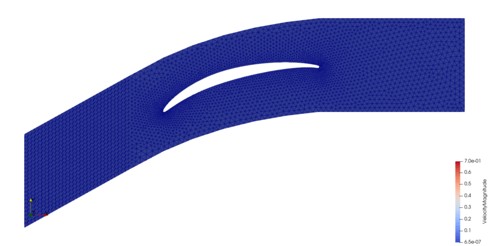

# 2D Low Reynolds Outlet Guide Vane
This example comes from DLR's work investigated in the SciFiTurbo project.

It has the following characteristics:

- it relies on Navier-Stokes compressible equations,
- the Reynolds number is around 150,000.

⚠️ **Warning**: this use-case is not fully stable and fails in multi-step adaptation processes.

## Getting started
This use-case can be executed with the following steps:

First, move to the example directory:
```sh
cd examples/ogv_blade_2d
```

The default mesh in the folder can be generated with the following command:
```sh
python3 ../../mesh/ogv_mesh.py --name ogv-blade --input ogv-blade.dat
```
which should generate a first order unstructured mesh.

The adaptation script can then be executed:
```sh
python3 ogv_adap.py --config ogv-blade.json
```

Results are saved in the `output-MEAN/out_N` directories and can be visualized with Paraview by loading `ogv-blade.vtu.series`. The .gif below illustrates the evolution of the mesh and velocity magnitude for an averaged adaptation process triggered over 10 solutions after 2.5 units of time:



## Detailed description
### Meshing script
The `ogv_mesh.py` script can be used to generate a mesh encompassing the blade and periodic boundary conditions:
```sh
usage: ogv_mesh.py [-h] [-c CONFIG] [-n NAME] [-out OUTDIR] [-f FORMAT] [-k ORDER] [-l] [-g]
                   [-s] -in INPUT

options:
  -h, --help            show this help message and exit
  -c CONFIG, --config CONFIG
                        mesh config file (default: )
  -n NAME, --name NAME  mesh name (default: madlib_pyfr_mesh)
  -out OUTDIR, --outdir OUTDIR
                        mesh output directory (default:
                        /home/mschouler/Documents/Sorbonne/MAdLib-
                        PyFR/examples/ogv_blade_2d)
  -f FORMAT, --format FORMAT
                        mesh format (default: msh)
  -k ORDER, --order ORDER
                        mesh order (default: 1)
  -l, --log             generate gmsh .log file (default: False)
  -g, --geo             generate gmsh .geo file (default: False)
  -s, --structured      generates a structured mesh (default: False)
  -in INPUT, --input INPUT
                        path to the geometry (default: None)
```

The same script can be used to generate both pseudo-structured (i.e. with quads) and unstructured meshes of any order based on the options passed to it. This can be convenient to generate reference solutions with PyFR but be aware that structured meshes can not be used for anisotropic mesh adaptation.

By default the generated mesh is 2D and no specific treatment is applied to the boundary layer nor the wake. However, the `"mesh_config"` entry of the use-case configuration file can be used to define specific attributes related to these aspects. For instance, a 3D mesh can be generated by specifying a positive number of extrusion layers in `"domain"`, a boundary layer mesh can be designed by setting `"bl"` to `true` in the `"boundary_layer"` entry, and a refinement region can be produced in the wake by setting `"wake"` to `true` in the `"wake"` entry.

💡 **Tip**: non-default attributes can be parameterized in `"boundary_layer"` through the following keywords: `"size"`, `"ratio"`, `"thickness"` and `"sizefar"`.

📝 **Note**: all default mesh parameters come from a Gmsh script designed for high-order computations by M. Bergmann from DLR.

### MAdLIb script
The three scripts associated to this use-case are the same as the ones associated to the incompressible cylinder example. The only particularity in this case is that the `--freeze` option should be used to fix the nodes on the boundaries. This ensures the periodicity is conserved.

📝 **Note**: this option should be removed as soon as the periodic feature of MAdLib is fully functional.

### Coupling script
The `ogv_adap.py` script is an advanced version of the incompressible cylinder example script:
```sh
usage: ogv_adap.py [-h] -c CONFIG [--mesh MESH] [--restart RESTART] [--sol SOL]
                        [--verbose {DEBUG,INFO,WARNING,ERROR,CRITICAL}]

options:
  -h, --help            show this help message and exit
  -c CONFIG, --config CONFIG
                        config file (default: None)
  --mesh MESH           gmsh file in case of restart (default: )
  --restart RESTART     restart adaptation from the given adaptation step (default: 0)
  --sol SOL             .pyfrs solution file in case of restart (default: )
  --verbose {DEBUG,INFO,WARNING,ERROR,CRITICAL}
                        Set the logging level (default: DEBUG)
```

Similarly to the incompressible cylinder example, the adaptation can be run instantaneously, by integrating multiple solutions or with automatic control.

A particularity of this script is that it computes the quantity of interest based on PyFR sensors. This is parameterized in the `"interpolation_lines"` entry of the configuration file and the functions `compute_pts`, `compute_mixedout_qty` and the overridden method `compute_QoI_sublist`.

⚠️ **Warning**: this feature currently causes PyFR to crash with the following error:
```txt
Traceback (most recent call last):
  File "/path/to/PyFR/pyfr-venv/bin/pyfr", line 8, in <module>
    sys.exit(main())
             ^^^^^^
  ...
                                 ^^^^^^^^^^^^^^^
  File "/path/to/PyFR/pyfr/points.py", line 55, in elocator
    return self._find_closest_element_bbox(etype, pts)
           ^^^^^^^^^^^^^^^^^^^^^^^^^^^^^^^^^^^^^^^^^^^
  File "/path/to/PyFR/pyfr/points.py", line 162, in _find_closest_element_bbox
    sidx, icounts = idx.intersection_v(pts, pts)
                    ^^^^^^^^^^^^^^^^^^^^^^^^^^^^
  File "/path/to/PyFR/pyfr-venv/lib/python3.12/site-packages/rtree/index.py", line 1088, in intersection_v
    len(ids),
    ^^^^^^^^
TypeError: object of type 'NoneType' has no len()
```
It was hence deactivated by passing the `Adapter` class to the main in `ogv_adap.py`. It can be turned back on by passing the `OGVAdapter` class to the main, by removing the trailing underscore of `"statistical_criteria_"` in the configuration file and by uncommenting the plugin samplers in `ogv-blade.ini`.

📝 **Note**: the PyFR .ini file is a simplification of the one designed by T. Flynn from ICL.

### VTK script
The `VTKProcessor/main.cc` script is the same as the one used in the incompressible cylinder use-case. Since the present use-case is compressible, it may be worth computing the Mach number instead of the velocity magnitude.

## To go further
As such, this use-case does not present much interest and it would require a few adjustments to make it relevant. Suggestions to do so are given below:
- 2D to 3D: for turbulent structures to develop, the simulation needs to be 3D. To do so, the user would need to generate a 3D mesh and extend `ogv_adap.py` to sample points in a plane rather than along a line (see `compute_pts`) and to compute 3D mixed-out quantities (see `compute_mixedout_qty`).
- Parallelism: although the 2D version can be simulated in a reasonable amount of time with a single GPU, the 3D version requires parallelism over multiple GPU nodes. The current coupling has never been tested with domain decomposition but a partition step should be added to the import method (see `import_mesh`). Since PyFR generates single domain solution files, the coupling should still be functional but the adaptation step may become a bottleneck. MAdLib parallel version of the metric computation and mesh adaptation is under intensive development and should soon address this potential concern.
- Periodicity: this feature is still under development for MAdLib. The 2D version should be ready soon while the 3D version in a matter of weeks to months.
- Stability: this use-case has proved quite hard to deal with and crashes in most configurations after a few adaptation steps. This could be due to several reasons (the initial mesh or domain, the timestep, the periodicity management, etc.) that are yet to be understood and fixed.
